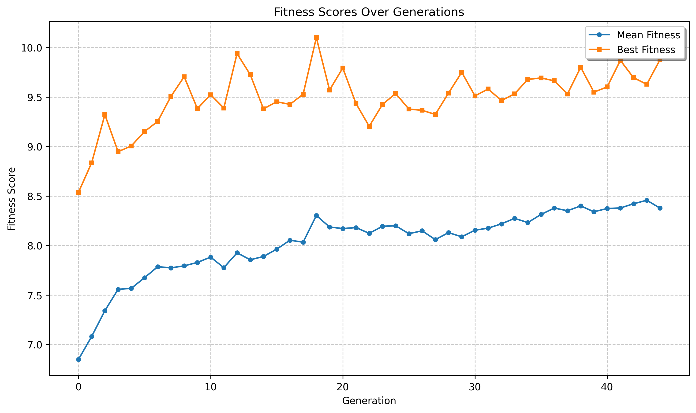
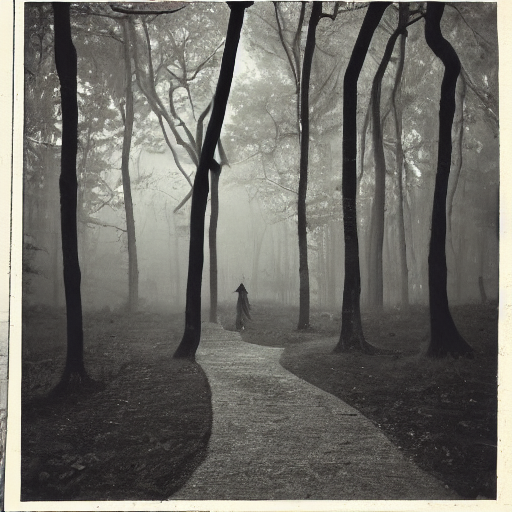

# GeneticPrompts 🧬

A fun experimental project exploring genetic algorithms applied to Stable Diffusion prompts. 
This project evolves text prompts over multiple generations to try to find the maximum aesthetic score.
Crossover, Mutation, and initial prompts are generated using tiny LLMs.

## How It Works

1. **Initial Population**: Starts with a population of random prompts generated by a tiny LLM
2. **Fitness Evaluation**: Generates images from each prompt and scores them with an aesthetic score
3. **Selection**: Selects the top 75% of prompts based on their fitness scores
4. **Crossover**: Creates new prompts by combining the top prompts (using a tiny LLM)
5. **Mutation**: Randomly mutates the new prompts
6. **Repeat**: The process continues for multiple generations

## Example Run

Here's an example of the algorithm trying to evolve prompts to match a target image:

### Target vs Best Result
Fitness over generations:

Starting image (sample from dataset) with an aesthetic score of 6.5:

Best result (aesthetic score 10.175):

